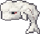

#  Enclose Moby AI: Hybrid Optimization Solver


**Enclose Moby AI** is an advanced algorithmic solver designed to optimize wall placements in the "Enclose Moby" puzzle. The project demonstrates the evolution from a standard heuristic approach to a highly optimized **Genetic Algorithm** capable of finding the **Global Optimum (68 Points)** in complex grid environments.

> **Key Achievement:** Successfully solved the Pathfinder Map with a score of **68/68** using a custom "Soft Penalty" Genetic Algorithm, overcoming the "Valley of Death" local optimum where standard algorithms failed.

---

## 📂 Project Structure

This repository is organized to show both the **production-ready code** and the **research history** behind the solution.

```text
enclose.mobyAi/
│
├── src/                        # 🚀 PRODUCTION CODE (Clean Architecture)
│   ├── common/                 # Shared models and constants
│   ├── generator/              # Procedural Level Generator (Phase 2)
│   ├── solver/                 # The Genetic Algorithm Logic
│   └── visualization/          # Console & GUI Visualizers
│
├── research_history/           # 🧪 R&D LAB (The Engineering Journey)
│   └── solver/
│       ├── v1_baseline_limitations.py  # The failed attempt (Stuck at 65)
│       └── v2_soft_penalty_solution.py # The successful solution (Reached 68)
│
└── main.py                     # Entry point